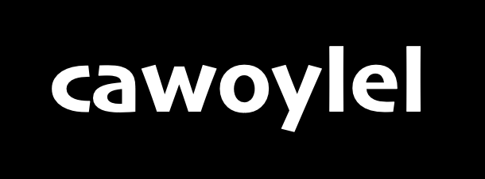

<h1 align="center">NLP4ALL Tutorials</h1>

  

While at [Cawoylel](https://cawoylel.com/) our primary focus is the Fula language, in this **NLP4ALL** repository, we openly share our journey and the methodologies behind building these technologies. We provide **step-by-step guides**, **tutorials**, and **code snippets**, allowing others to replicate our efforts with the Fula language or adapt our work. Our goal is to offer **readily usable templates** that other communities can leverage to develop similar technologies for their languages. 

## Tutorial Checklist

Below is a checklist of tutorials currently available and those that are in the pipeline:

1. Speech Processing
    - [x] [**Speech-to-Text**](https://colab.research.google.com/github/cawoylel/nlp4all/blob/main/asr/src/asr_tutorial.ipynb#scrollTo=ZHqkn2_OCz4Y): Training an Automatic Speech Recognition (ASR) model when you don't have the annotated data: The **Seereer language** as a case study.
    - [ ] **Text-to-Speech**: Training a Speech Synthesis model
    - [ ] **Audio Data Collection**: Collect, process, prepare and segment audio data from youtube for **Audio Pretraining** tasks
    - [ ] **Self-supervised Speech Pretraining**

2. Machine Translation
    - [ ] **Machine Translation data extraction and alignment from PDF documents**: A Practical Guide to Extracting and Aligning Translation Data for languages with limited online ressources
    - [ ] **Enhance your Machine Translation model by leveraging monolingual data and backtranslation**
    - [ ] **Large Language Models for machine translation in data scarcity scenario**

3. Language Modelling
    ...

  
## Get Started

Explore the available tutorials and code to begin your journey in building AI solutions for your language.

**Note:**

* The checkbox (✅) indicates currently available tutorials. 
* This checklist can be expanded as more tutorials are added to the repository.
  
# Join the Movement:

We invite you to contribute to this project! Share your experiences, ask questions, and help us build a thriving NLP ecosystem for all languages.

Stay Connected:

- Follow us on [LinkedIn](https://www.linkedin.com/company/cawoylel/?viewAsMember=true) or [Twitter/X](https://twitter.com/cawoylel)
- Get updates on our latest projects and tutorials
